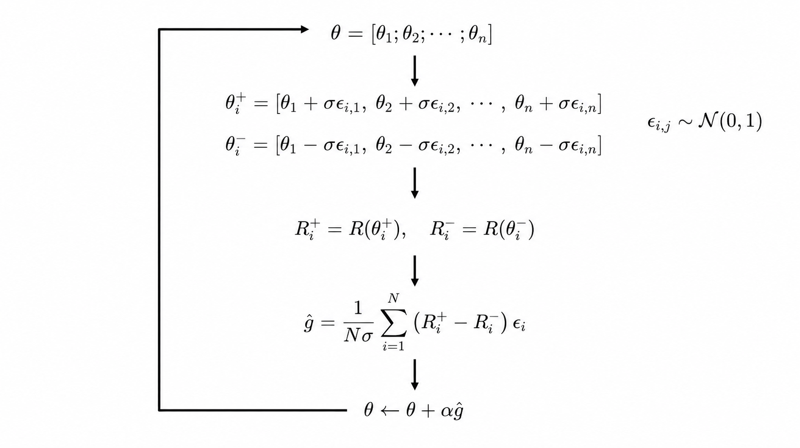
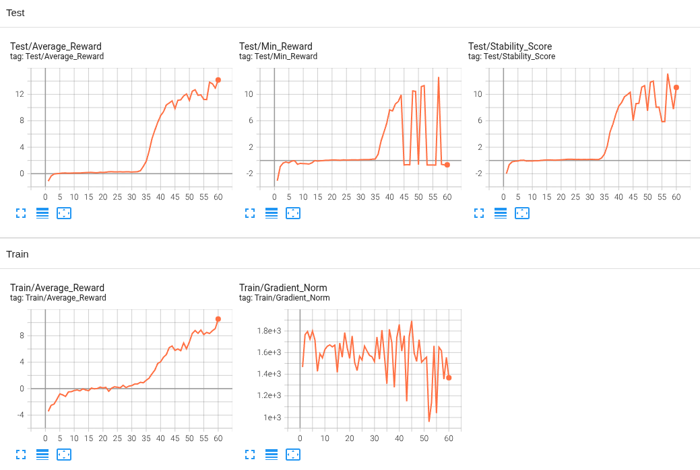

# Under-Construction
Making an agent walk with legs using reinforcement learning in Unity was a real challenge for me. After several attempts, it finally worked with two main factors: radian/degree conversion and Evolution Strategies. Configurable Joint could not be used because it did not behave like a rigid connection, which made Articulation Body necessary. The previous problem with Articulation Body—no movement during deterministic actions—was caused by not converting between radians and degrees. Joint values (jointPosition) in the Articulation Body are represented in radians, so without converting them to degrees, the joint angles are nearly indistinguishable. This caused incorrect observations and resulted in no movement. However, after fixing this problem and training with PPO, it was difficult to observe any meaningful increase in the reward because the agent initially fell immediately and received very similar rewards regardless of its actions, making PPO’s clipped update mechanism ineffective for discovering meaningful walking behavior, since the small reward differences provided little useful gradient information for policy improvement. It is unclear whether PPO alone would work with long training time, but I wanted to see the reward increase within a short time. So I decided to implement ES to find initial neural network parameters capable of slight walking behavior and then continued training with PPO to further improve and stabilize locomotion.

ES and PPO are implemented in PyTorch, and ES is based on the OpenAI ES paper [*Evolution Strategies as a Scalable Alternative to Reinforcement Learning*](https://arxiv.org/pdf/1703.03864). For PPO, there are two improvements over the previous implementation: action selection for multiple agents is batch-processed for faster computation, and transition collection continues even after episode termination while waiting for other agents, with correct GAE computation. The observations and hyperparameters are partially based on the quadrupedal paper [*Learning to Walk in Minutes Using Massively Parallel Deep Reinforcement Learning*](https://arxiv.org/pdf/2109.11978).

You can play against the FourLeg NarrowPath Walking AI directly in your browser [Play on itch.io](https://apzmie.itch.io/fourleg-narrowpath-walking-ai), on both PC and mobile devices. Due to a forced refresh problem and to focus more on reinforcement learning, mobile play will no longer be added in WebGL from the next project.

## Environment
### Unity
- Unity Editor: 6000.3.0f1
- ML Agents: 4.0.2
- Sentis: 2.5.0

### Python
- Python 3.10.12

## ES Diagram

### Comparison to Genetic Algorithm
Genetic Algorithm creates new parameters through parent crossover, while Evolution Strategies independently generates multiple parameter variations and updates in the direction of the variants that perform better.

### Mirrored Noise Sampling
When noise is added to the weights, the opposite sign is also applied to create symmetry, which helps determine which direction is better.

### Pseudo-Gradient Optimization
Although the gradient is a pseudo-gradient rather than an exact gradient computed through backpropagation, Adam can still be used for parameter updates because the pseudo-gradient provides an estimate of the optimization direction.

## Training Progress (ES plot)

The gradient norm is monitored during training to check whether training is progressing well. If the gradient norm shows little or no variation over time, it indicates that the optimization process has become inactive.

Although the average reward during training appears to change very little in the early stage, it gradually increases over time, indicating that the model is still learning continuously even though the improvement is slow. The average rewards during training and testing are different because the training reward is averaged over multiple parameter variants, whereas the test reward is obtained by applying a single parameter to multiple agents and averaging their rewards. Even when multiple agents share the same neural network and environment, their behaviors differ because computers represent numbers using a finite number of bits (0s and 1s), which makes very small numerical errors. If these errors accumulate over time, they lead to differences in behavior. It is expected that these errors should be applied identically to all agents and lead to the same behavior. However, due to small differences in how parallel computations are executed, small numerical errors can differ between agents.

The model is saved based on both an increase in average reward and a small difference in rewards between agents, due to stable performance.

## Conclusion
The agent was enabled to take baby steps using ES. To further training the pretrained model with PPO, The actor was initially frozen, and only the critic was optimized to learn the environment.
After that, the actor was unfrozen and trained together with the critic, and the agent reached a basic walking level. Simple reward signals were sufficient for the agent to reach a basic walking level. When additional observations were added, the weights corresponding to the new observations were initialized to zero, preserving the prior behavior and enabling further training. These methods will be highly beneficial for agents to perform a wide range of behaviors in the future.

One limitation was that during further training with PPO, the maximum average reward achieved good performance, but it failed to improve beyond that performance despite having room for further improvement. This may be caused by two factors: zero gradient and reduced exploration. Parameter updates do not occur when the policy is already moving strongly in the correct direction, and exploration is gradually reduced once the agent discovers actions that obtain high rewards. So new methods will be required to solve this limitation.
